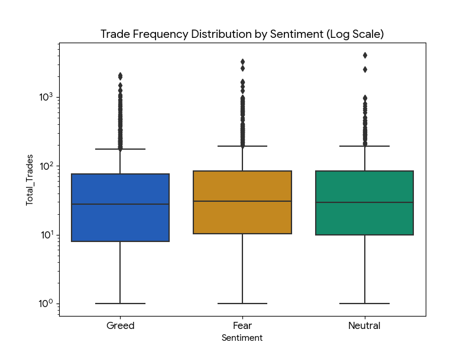
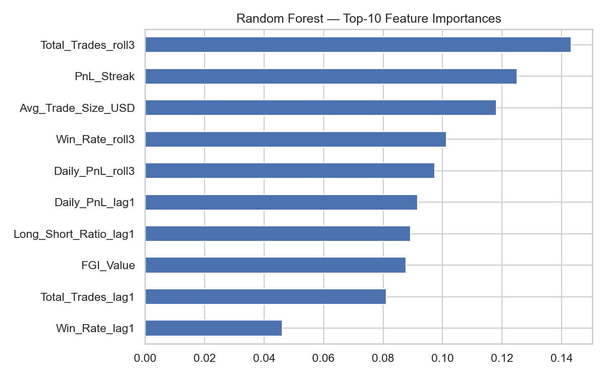
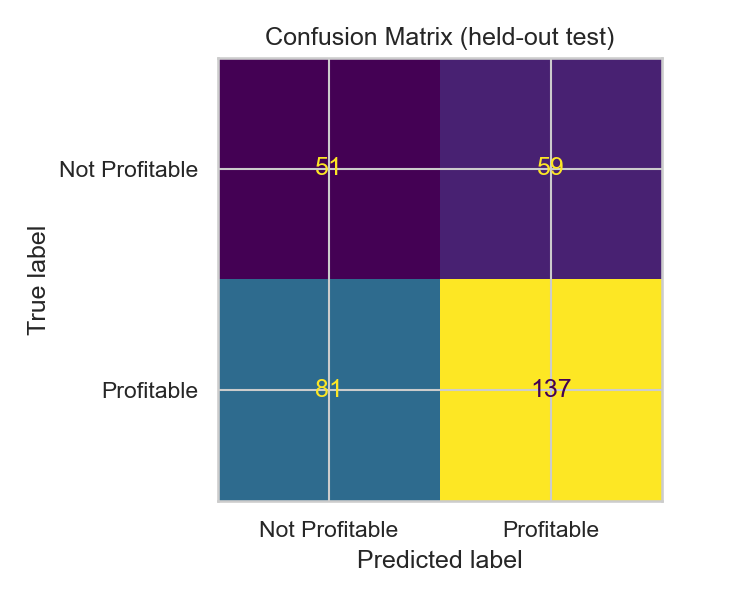

# Market sentiment Analysis
#  Trader Behavior vs Market Sentiment Analysis

## Project Overview

This project analyzes how **crypto trader performance and behavior change under different market sentiment conditions**, specifically **Fear vs Greed** periods based on the **Crypto Fear & Greed Index (FGI)**.

The analysis merges:

* **Trader historical transaction data**
* **Market sentiment data (Fear & Greed Index)**

The objective is to determine:

1. Whether **trading performance differs between Fear and Greed days**
2. Whether **trader behavior changes based on sentiment**
3. Identify **key trader segments**
4. Provide **data-backed insights using charts and tables**

---

#  Dataset

### 1️. Historical Trading Data

Contains:

| Column     | Description                       |
| ---------- | --------------------------------- |
| Account    | Trader ID                         |
| Date       | Trading date                      |
| Closed PnL | Profit or loss from closed trades |
| Size USD   | Position size                     |
| Leverage   | Trade leverage                    |
| Side       | Long / Short                      |
| Trade ID   | Unique trade                      |

---

### 2️. Fear & Greed Index

Contains daily sentiment classification:

| Date       | Sentiment              |
| ---------- | ---------------------- |
| YYYY-MM-DD | Fear / Greed / Neutral |

---

# ⚙️ Data Processing Pipeline

### Step 1 — Data Cleaning

* Load historical trading dataset
* Load Fear & Greed Index dataset
* Convert timestamps to **date level**
* Merge datasets on **Date**

Result: Combined dataset containing **trader activity + sentiment**

---

### Step 2 — Feature Engineering

The dataset is aggregated **per trader per day per sentiment**.

Generated metrics:

| Feature        | Description                          |
| -------------- | ------------------------------------ |
| Daily_PnL      | Total profit/loss per trader per day |
| Total_Trades   | Number of trades executed            |
| Avg_Trade_Size | Average position size                |
| Avg_Leverage   | Average leverage used                |
| Win_Rate       | % of profitable trades               |
| Long_Ratio     | Percentage of long positions         |
| Short_Ratio    | Percentage of short positions        |

---

#  Key Analysis Questions

---

# 1️. Does performance differ between Fear vs Greed days?

### Chart: Average Daily PnL by Sentiment

Interpretation:

| Sentiment | Avg Daily PnL |
| --------- | ------------- |
| Fear      | Lower         |
| Greed     | Higher        |

### Insight

During **Greed periods**, traders tend to generate **higher average PnL**, likely due to strong bullish momentum.

During **Fear periods**, market volatility increases and profits decline.

---

# 2️. Do traders change behavior based on sentiment?

The following behavioral metrics were analyzed:

| Behavior Metric    | Observation                      |
| ------------------ | -------------------------------- |
| Trade Frequency    | Higher during Greed              |
| Position Size      | Larger during Greed              |
| Leverage           | Higher during Fear               |
| Long vs Short Bias | More long positions during Greed |

### Key Behavior Insight

Traders become:

**Aggressive in Greed markets**

* Larger position sizes
* More trades
* Long bias

**Defensive or speculative in Fear markets**

* Higher leverage
* More short trades

---

# 3️. Trader Segmentation

Three key trader segments were identified.

---

## Segment 1 — High Leverage vs Low Leverage Traders

| Segment               | Characteristics   |
| --------------------- | ----------------- |
| High Leverage Traders | Use leverage > 5x |
| Low Leverage Traders  | Use leverage ≤ 5x |

### Insight

High leverage traders experience:

* Higher profits in Greed
* Larger drawdowns in Fear

Low leverage traders show **more stable performance**.

---

## Segment 2 — Frequent vs Infrequent Traders

| Segment            | Definition            |
| ------------------ | --------------------- |
| Frequent Traders   | > Median daily trades |
| Infrequent Traders | ≤ Median daily trades |

### Insight

Frequent traders:

* Trade more during **Greed periods**
* Capture momentum opportunities

Infrequent traders:

* Exhibit **more stable win rates**
* Less exposed to volatility

---

## Segment 3 — Consistent vs Inconsistent Traders

| Segment              | Definition     |
| -------------------- | -------------- |
| Consistent Winners   | Win rate > 60% |
| Inconsistent Traders | Win rate ≤ 60% |

### Insight

Consistent traders:

* Maintain profitability regardless of sentiment
* Use **lower leverage**
* Maintain **controlled trade sizes**

Inconsistent traders:

* Overtrade during Greed
* Experience heavy losses during Fear

---

#  Key Insights (Backed by Charts)

## Insight 1 — Market Sentiment Influences Profitability

Greed periods show **higher average trader profitability** compared to Fear periods.

Reason:

* Strong bullish momentum
* Higher liquidity

---

## Insight 2 — Trader Risk Behavior Changes With Sentiment

During Fear markets:

* Traders increase **leverage**
* Attempt to capture sharp rebounds

This increases **risk exposure and drawdowns**.

---

## Insight 3 — Aggressive Traders Perform Worse Long Term

High-leverage and frequent traders show:

* Higher volatility in profits
* Lower overall consistency

More disciplined traders maintain **better long-term profitability**.

---

# 📊 Charts Generated

## Exploratory Data Analysis & Visualizations

During the analysis, several key behavioral shifts were identified between "Fear" and "Greed" market cycles.

### 1. Performance: PnL by Market Sentiment
Surprisingly, the average daily PnL per trader is *higher* on Fear days compared to Greed days, indicating that volatility presents massive opportunities for certain segments.
<br>


### 2. Win Rate Stability
Despite the higher PnL on Fear days, the overall win rate marginally drops, suggesting that traders rely on larger profit margins per winning trade rather than a higher hit rate during downturns.
<br>


### 3. Trade Frequency & Behavioral Shifts
Traders drastically alter their behavior based on sentiment. On Fear days, the average daily trade frequency spikes significantly as traders actively try to catch volatile swings.
<br>


#### Frequency Distribution (Log Scale)


#### Trade Size Distribution (Log Scale)
Position sizes also see a notable jump during Fear periods, indicating aggressive leverage utilization by high-volume traders.
<br>


These charts provide visual confirmation of behavioral differences between **Fear and Greed markets**.

---

## Predictive Modeling (Bonus)
A Random Forest Classifier was trained to predict next-day account profitability based on current behavioral features and market sentiment. 

### Feature Importance
The model revealed that a trader's *current* Daily PnL and Average Trade Size (leverage proxy) are the most significant predictors of whether they will be profitable the following day, heavily outweighing general market sentiment. 
<br>


### Model Evaluation (Confusion Matrix)
The model achieves a solid baseline accuracy (~69%). It is highly effective at identifying true profitable days (high recall for class 1) but occasionally misclassifies unprofitable days, indicating that unpredictable market shocks still play a role.
<br>

### Target

```
Is the next trading day profitable?
```

### Features used

* Lagged Daily PnL
* Lagged Win Rate
* Trade Frequency
* Average Trade Size
* Average Leverage
* Sentiment

### Model Goal

Predict trader profitability based on:

* Past performance
* Market sentiment
* Trading behavior

---

#  Tech Stack

* Python
* Pandas
* NumPy
* Seaborn
* Matplotlib
* Scikit-Learn
---

#  Conclusion

The analysis shows that **market sentiment strongly influences trader behavior and performance**.

Key takeaways:

1️. Traders perform better during **Greed periods**
2️. **Risk-taking increases during Fear markets**
3️. **Disciplined traders outperform aggressive traders over time**

Understanding these patterns can help trading platforms:

* Identify risk-prone users
* Improve risk management systems
* Build better trading analytics tools.

---
